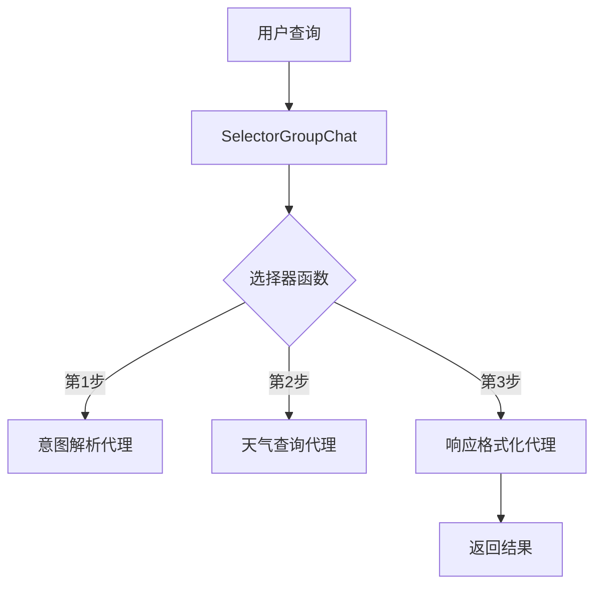
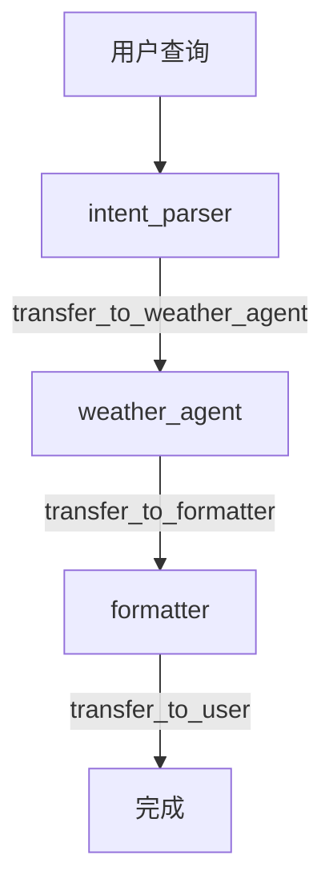
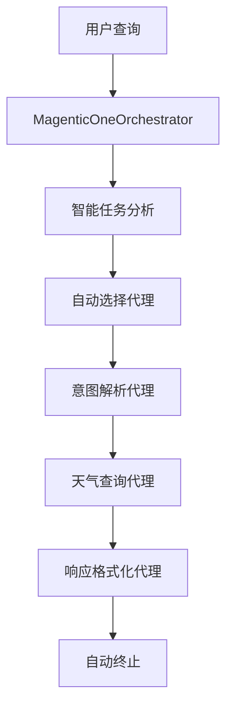

# AutoGen 多代理协作天气查询系统

基于 Microsoft AutoGen 框架的多代理协作天气查询系统，支持智能 IP 定位和多种团队协作机制。现已支持三种不同的协作模式：**SelectorGroupChat**、**Swarm**、**Magentic-One**。

## 🌟 项目特色

- 🧠 **意图解析代理** - 分析用户查询意图，提取城市和时间信息
- 🌤️ **天气查询代理** - 调用天气 API 获取数据，支持自动 IP 定位
- ✨ **响应格式化代理** - 格式化输出并提供生活建议
- 🧲 **Magentic-One 协作** - 智能自动化团队协作，无需手动配置协作流程
- 📍 **智能定位** - 用户无需指定城市，自动通过 IP 获取地理位置
- 🎯 **三种协作模式** - 支持 SelectorGroupChat、Swarm、Magentic-One 三种不同的协作机制

## 📁 项目结构

```plain
weather_autogen/
├── src/                        # 核心源代码
│   ├── weather_cli.py          # 通用命令行界面（包含演示功能）
│   ├── selector_groupchat/     # 集中式选择器协作模式
│   │   ├── weather_team.py     # 协作管理器
│   │   └── weather_agents.py   # 代理定义
│   ├── swarm/                  # 去中心化handoff协作模式
│   │   ├── weather_team.py     # 协作管理器
│   │   └── weather_agents.py   # 代理定义
│   └── magentic_one/           # 智能自动化团队协作模式
│       ├── weather_team.py     # 协作管理器
│       └── weather_agents.py   # 代理定义
├── mcp_server/                 # MCP 服务器
│   └── weather_mcp_server.py   # 彩云天气MCP服务器(支持IP定位)
├── tests/                      # 测试套件
│   ├── run_tests.py            # 测试运行脚本(支持交互式模式选择)
│   ├── test_weather_agents.py  # 代理测试(支持动态模式导入)
│   ├── test_api.py             # API测试
│   ├── test_mcp_server.py      # MCP服务器测试
│   └── reports/YYYYMMDD/       # 按日期分组的测试报告
├── requirements.txt            # 依赖包
└── README.md                  # 项目文档
```

## 🚀 快速开始

### 1. 进入项目目录

```bash
cd mcp/weather_autogen
```

### 2. 激活虚拟环境（如果还没有）

```bash
# 创建虚拟环境
python -m venv .venv

# 激活虚拟环境
source .venv/bin/activate  # macOS/Linux
# 或 .venv\Scripts\activate  # Windows
```

### 3. 安装依赖

```bash
pip install -r requirements.txt
```

### 4. 设置 API 密钥

```bash
# 复制配置模板
cp .env.example .env.local

# 编辑 .env.local 文件，填入API密钥：
# OPENAI_API_KEY=your-openai-api-key
# CAIYUN_API_KEY=your-caiyun-api-key
```

### 5. 运行天气查询系统

```bash
# 推荐：通用CLI（交互式选择协作模式）
python src/weather_cli.py "今天天气怎么样"

# 指定协作模式
python src/weather_cli.py --mode magentic_one "今天天气"
python src/weather_cli.py --mode swarm "今天天气"

# 演示模式
python src/weather_cli.py --demo

# 注意：源代码模块专注业务逻辑，演示功能统一通过 CLI 提供
```

## 🎯 支持的查询类型

| 查询类型 | 示例           | 特殊功能    | 三种协作模式共同流程                  |
| -------- | -------------- | ----------- | ------------------------------------- |
| 今日天气 | "今天天气"     | IP 自动定位 | intent_parser→weather_agent→formatter |
| 明日天气 | "明天会下雨吗" | IP 自动定位 | intent_parser→weather_agent→formatter |
| 未来天气 | "未来三天天气" | IP 自动定位 | intent_parser→weather_agent→formatter |
| 城市指定 | "北京明天天气" | 直接查询    | intent_parser→weather_agent→formatter |
| 城市指定 | "上海今天天气" | 直接查询    | intent_parser→weather_agent→formatter |

**协作差异**：

- **SelectorGroupChat**：选择器函数控制每步转换
- **Swarm**：代理主动 handoff 交接控制权
- **Magentic-One**：Orchestrator 智能自动调度

### 🆕 智能 IP 定位功能

当用户查询**没有明确指定城市**时，系统会：

1. 自动通过 IP 地址获取用户地理位置
2. 智能匹配到支持的中国城市
3. 为非中国地区提供友好提示

## 🛠️ 技术架构

### 核心组件

- **WeatherAgentTeam**: 协作管理器，支持三种协作模式
- **意图解析代理**: 分析用户查询意图，提取城市和时间信息
- **天气查询代理**: 通过 MCP 协议调用天气工具，集成智能定位
- **响应格式化代理**: 格式化输出结果，提供生活建议
- **CLI 演示系统**: 统一的命令行接口，支持交互式演示和模式选择

### 🤖 协作模式实现

#### 📋 1. SelectorGroupChat - 集中式选择器协作

**核心机制**：中央选择器函数控制代理执行顺序



**协作流程**：

1. **中央调度** - 选择器函数分析消息历史，决定下一个代理
2. **顺序执行** - 意图解析 → 天气查询 → 响应格式化
3. **显式控制** - 每步转换都由选择器逻辑明确控制

**特点**：

- ✅ 流程可控，便于调试
- ✅ 执行顺序明确可预测
- ❌ 需要编写 76 行选择器逻辑
- ❌ 扩展时需修改选择器函数

#### 🐝 2. Swarm - 去中心化 handoff 协作

**核心机制**：代理主动调用 handoff 函数交接控制权



**协作流程**：

1. **主动交接** - 每个代理完成任务后主动调用 `transfer_to_xxx()`
2. **去中心化** - 无中央控制器，代理自主决策下一步
3. **声明式配置** - 通过 `handoffs` 声明可交接的目标代理

**特点**：

- ✅ 代理自主性强，扩展灵活
- ✅ 零选择器逻辑，声明式配置
- ❌ 需要理解 handoff 机制
- ❌ 调试相对复杂（去中心化）

#### 🧲 3. Magentic-One - 智能自动化团队协作

**核心机制**：MagenticOneOrchestrator 智能分析和自动调度



**协作流程**：

1. **智能分析** - Orchestrator 分析任务类型和代理能力
2. **自动调度** - 根据代理描述自动选择和协调执行
3. **零配置** - 代理只需专注任务，无需协作逻辑

**特点**：

- ✅ 完全自动化，零协作配置
- ✅ 智能调度，学习成本最低
- ✅ 最佳的代码简洁度
- ⚡ AutoGen 最新推荐模式

### 🔄 协作模式对比示例

| 特性           | SelectorGroupChat       | Swarm               | Magentic-One        |
| -------------- | ----------------------- | ------------------- | ------------------- |
| **配置复杂度** | 复杂选择器函数 (~76 行) | 简单 handoffs 声明  | 零配置，仅需描述    |
| **协作方式**   | 集中式调度              | 去中心化交接        | 智能自动化协作      |
| **代理自主性** | 低（被动选择）          | 中（主动交接）      | 高（智能协调）      |
| **系统管理**   | 手动选择器逻辑          | 声明式 handoffs     | 自动化 Orchestrator |
| **学习成本**   | 高（复杂逻辑）          | 中（理解 handoffs） | 低（直观描述）      |
| **调试友好度** | 中（选择器可见）        | 中（交接明确）      | 高（自动化管理）    |
| **扩展性**     | 低（修改选择器）        | 中（配置 handoffs） | 高（添加描述）      |
| **代码量**     | 最多                    | 中等                | 最少                |

**相同任务**：`"上海明天天气"`

#### SelectorGroupChat 执行流程

```plain
1. 选择器函数：messages.length <= 1 → 选择 intent_parser
2. intent_parser：解析得到 城市=上海，时间=tomorrow
3. 选择器函数：last_speaker == intent_parser → 选择 weather_agent
4. weather_agent：调用 query_weather_tomorrow("上海")
5. 选择器函数：last_speaker == weather_agent → 选择 formatter
6. formatter：美化输出 + 生活建议 → 完成
```

#### Swarm 执行流程

```plain
1. intent_parser：解析查询 → transfer_to_weather_agent()
2. weather_agent：获取天气数据 → transfer_to_formatter()
3. formatter：美化输出 → transfer_to_user() → 完成
```

#### Magentic-One 执行流程

```plain
1. MagenticOneOrchestrator：分析任务 → 自动选择 intent_parser
2. intent_parser：解析查询 → 自动交接 weather_agent
3. weather_agent：获取数据 → 自动交接 formatter
4. formatter：输出结果 → 自动终止
```

### MCP 工具函数

- `query_weather_today(city)` - 查询今天天气
- `query_weather_tomorrow(city)` - 查询明天天气
- `query_weather_future_days(city, days)` - 查询未来几天天气
- `get_user_location_by_ip()` - **新增**：通过 IP 自动获取用户地理位置
- `get_supported_cities()` - 获取支持的城市列表
- `get_city_coordinates(city)` - 获取城市坐标信息

### 添加新的工具

在 MCP 服务器中添加新的工具，然后 AutoGen 会自动发现并使用。

## 🌈 运行示例

```plain
🤖 初始化天气查询系统...
✅ 系统准备就绪！

🗣️  用户查询: 今天北京天气怎么样
──────────────────────────────────────────────────
🔄 启动多代理协作...
   📋 意图解析代理 → 解析查询意图
   🌤️  天气查询代理 → 获取天气数据
   ✨ 响应格式化代理 → 美化输出结果

📋 查询结果:
根据最新天气预报，北京今天的天气是阴天，气温在27°C到35°C之间...
```

## 🔍 故障排除

### 常见问题

1. **API 密钥未设置**

   ```bash
   export OPENAI_API_KEY='your-api-key-here'
   ```

2. **依赖包问题**

   ```bash
   pip install -r requirements.txt --force-reinstall
   ```

3. **Python 环境问题**

   ```bash
   python --version  # 确保 Python 3.8+
   ```

### 🧪 测试和开发

```bash
# 运行测试套件（交互式选择协作模式）
python tests/run_tests.py

# 测试结果：50/50 (100%) 通过
# 报告保存在：tests/reports/20250627/
```

## 📊 项目信息

- **协作模式**: 三种（SelectorGroupChat、Swarm、Magentic-One）
- **代理数量**: 3 个（意图解析、天气查询、响应格式化）
- **MCP 工具**: 6 个（包含 IP 定位功能）
- **支持城市**: 37 个中国主要城市 + 全球 IP 定位
- **技术栈**: AutoGen 框架 + MCP + 彩云天气 API + IP 定位服务
- **测试覆盖**: 50 个测试用例，100%通过率
- **配置复杂度**: SelectorGroupChat (76 行) > Swarm (声明式) > Magentic-One (零配置)
- **架构设计**: 单分支多模式，源代码专注业务逻辑，CLI 统一处理演示

### 🔀 协作模式选择

```bash
# 通用CLI自动选择模式
python src/weather_cli.py

# 命令行指定模式
python src/weather_cli.py --mode selector_groupchat
python src/weather_cli.py --mode swarm
python src/weather_cli.py --mode magentic_one
```

---
